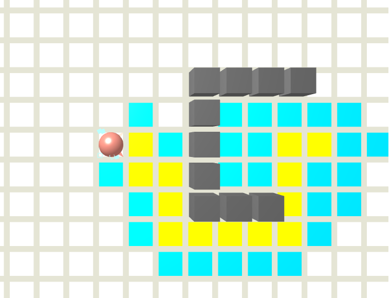
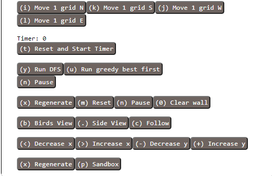

# cs174A-project
## A Path Finding Algorithm Visualization Tool

This project visualizes how different path finding algorithms find the path from one point to another, using `tiny graphics` library.

Currently, we have two path finding algorithms implemented\
* Depth first search (DFS)
* Greedy best first

# Initial Setup
1. Download [python3](https://www.python.org/downloads/)
2. Setup a fake server to run locally:\
`python3 ./server.py`\
Go to your browser\
It will be running at `localhost:8000`

# How to use 

Besides all the buttons in the control panel, you can use your mouse pointer to change starting and ending point (represented by a pointer and a ball respectively): single click to select, then single click again to place. You can also toggle walls by clicking on the highlighted grid.

